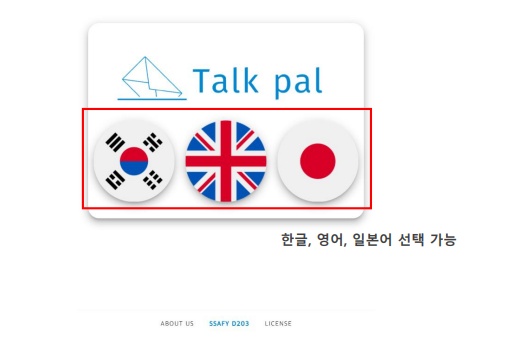
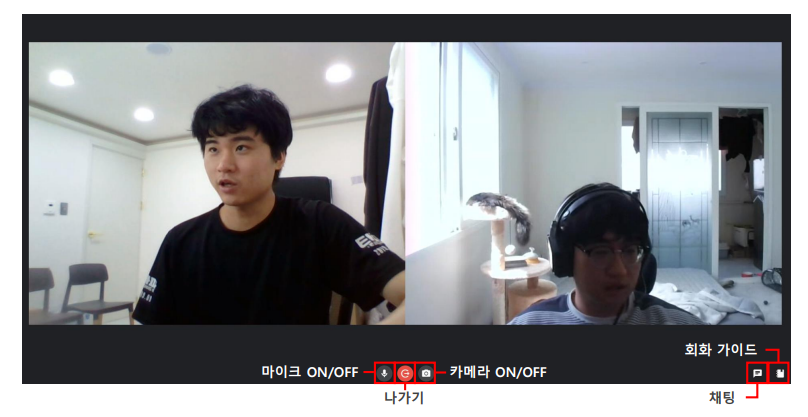
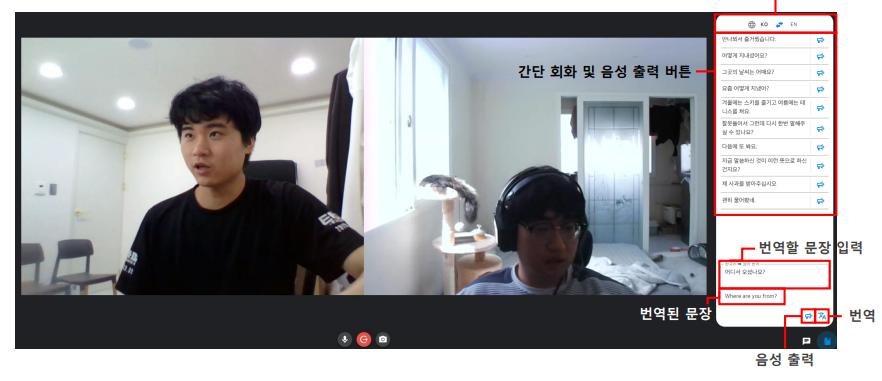
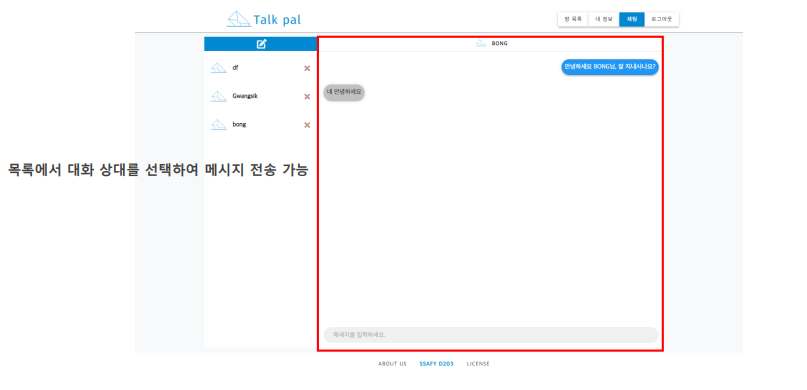

# TalkPal

> 팔로워 간 채팅/회화가이드/화상통화/ 다국어 지원 기능을 제공하는 화상회화서비스

## 사용 기술

`java1.8` `SpringBoot2.4.5` `docker` `Jenkins` `Nginx` `vue` `WebRTC`

## 개발기간

2021.07.05~2021.08.20

## Preview

### 다국어 지원

### 캠,마이크 on/off

### 회화가이드

### 팔로워 간 채팅

