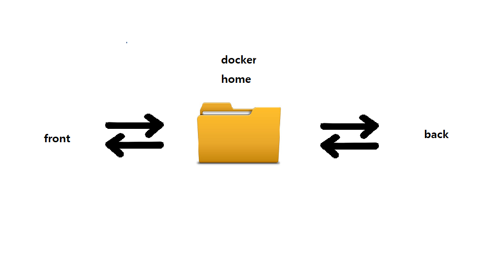

# 이미지 경로 볼륨 매핑


# 방법



- front의 폴더와 ec2 서버의 폴더를 마운트
- back의 폴더와 ec2 서버의 폴더를 마운트

=⇒ front의 폴더 == back의 폴더 


# Front


## nginx

- 이미지 경로 설정

```
server {
        listen 443 ssl;
        listen [::]:443 ssl;

        server_name [퍼블릭IPv4주소]

        ssl_certificate /usr/share/nginx/html/homepage/cert/fullchain.pem;
        ssl_certificate_key /usr/share/nginx/html/homepage/cert/privkey.pem;

        location /{
                 alias /usr/share/nginx/html/homepage/;
                 try_files $uri $uri/ /index.html;
        }
				
				//이미지 경로 설정
        location /file/{
                alias <nginx_container_volume_dir>;
                autoindex off;
        }
}

```


# JAVA

```java
// 개발 서버 / 배포 서버 확인 환경 변수
@Value("${isProd}")
    boolean isProd;

@PutMapping(value = "/saveimg/{userId}")
    public ResponseEntity<String> profileImg(@PathVariable String userId,
                                             @RequestPart("imgFile") MultipartFile imgFile) throws IOException {
        String basePath, frontPath, fileName, filePath;
				// 배포 서버 경로 설정
        if (isProd) { 
            basePath = "/volumes/profile/";
            frontPath = "";
				// 개발 서버 경로 설정
        } else { 
            String[] splitPath =
                    (new File("").getCanonicalPath().split("\\\\"));

            int splitPathLen = splitPath.length;

            // 프로젝트경로
            basePath = String.join("/", Arrays.copyOfRange(splitPath, 0,
                    splitPathLen - 1));

            frontPath = "/front/src/assets/image/profile/";
        }

        fileName = userId.toString() + "_profileImg.jpg";
        filePath = basePath + frontPath + fileName;
        File dest = new File(filePath);

        imgFile.transferTo(dest);

        // DB에 이미지 원본 이름만 저장
        Long userid = Long.parseLong(userId);
        if (userService.saveImgFile(userid, fileName)) {
            return ResponseEntity.status(200).body(imgFile.getOriginalFilename());
        }

        return ResponseEntity.status(500).body("이미지저장 실패");
    }
```


# docker

```bash
sh 'docker run -d --name front -p 80:80 -p 443:443 -v /home/ubuntu/yoon/cert:/usr/share/nginx/html/homepage/cert \
-v <home_dir>:<front_container_dir> \
--network our_net front'
sh 'docker run -d --name back -p 8080:8080 -v <home_dir>:<back_container_dir> --network our_net back'
```